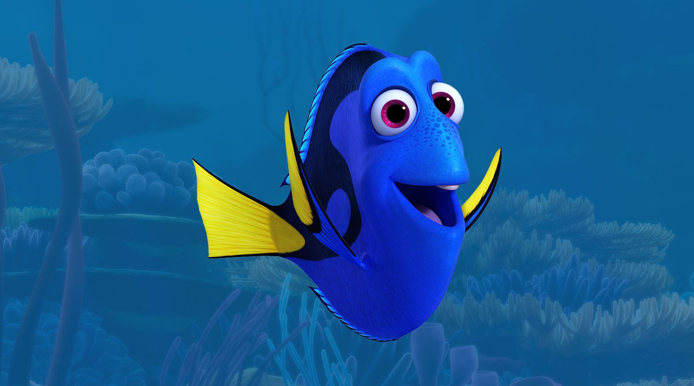

  Learning Javascript is like getting thrown into the deep end of the pool by your dad even though he knows you can't swim. 

Fortunately, there is [freeCodeCamp](https://www.freecodecamp.org/learn/javascript-algorithms-and-data-structures/) that acts like a "pool noodle" so I don't actually drown. After about 140 exercises I kind of get the hang of it! 

  What I like the most is JS's type inference similar to Scala's. For example, in C, we need to indicate a data type like so: 
```C
int age = 20;
``` 

But in JavaScript, all we need to do is simply
```JavaScript
var age = 20
```

You can even assign strings and arrays without explicitly typing the data type. And, did you notice we don't need the semicolon? That's right, I didn't forget it, we just don't need it! Just like Python and Scala, it is added behind the scenes. Of course, there are also similarities like compound assignments, operations, scopes, and loops which all have the same concepts with subtle syntax differences.

Additionally, we "swimming athletes" also go through a rigorous training called "WOD's"(workout of the day). So far I have had 2 WOD's, one in class with the professor and one with the TA. It was pretty easy, but I foresee that it will get much more complicated in the future and WOD's will definitely act a pivot role to succeed in this class. 

Along with the WOD's, there are also modules that we have to keep track of. These modules provide helpful screencasts, articles, and lectures from the professor. And most importantly, modules also indicate deadlines for assignments which is very helpful in my opinion.

All in all, the water was cold at first, but if you swim then you know that you have to keep moving and eventually your body will adapt. As Dory puts it: "Just keep swimming"! 

