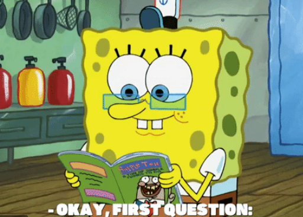

## Is ignorance a bad thing?
I think the word "ignorant" is thrown around way too often now-a-days. It is almost interchangeable with "stupidty". But one can take a look at the true definition of "ignorance" and find that it simply means a person is lacking knowledge or unaware of a particular thing. In my opinion, based on the definition, "ignorance" does not seem to be a pejorative term. A genius who excels in physics might be ignorant of botany, that certaily does not make he or she a stupid person. 

## Is there a such thing as a stupid question?
Let's take our genius physicist for another example. Suppose he or she asks a question a very simple question regarding botany. As a genius botanist, would you think that they are stupid for asking such a easy question? I wouldn't think so, however, asking simple questions leaves me the impression that this individual is lazy. We live in a era that any information can be accessed at any moment. There really shouldn't be any reason for people to be asking questions that can be found with a simple Google search. 

## I can't find the answer, now what?
Well, now you gotta ask questions! But hold your horses, how to ask questions is really an art form. Asking "smart" questions well most likely get you an answer and more likely to get you a response. On the contrary, if your question is full of grammar mistakes or not technical enough, how do you expect people understand your problem and help you? 

Let's look at this persons' [question](https://stackoverflow.com/questions/30910436/javascript-difference-between-and) on StackOverflow

Just looking at the votes we can tell people do not like this kind of questions. 

Questions like this is what I would say constitutes a person as lazy, or, as [Raymond](http://www.catb.org/esr/faqs/smart-questions.html) puts it: "a lazy sponge and wasting people's time". It clearly shows the lack of research because of how simple an answer to this question can be found online.

## The smart way to ask questions
Now let's look at another [question](https://stackoverflow.com/questions/289/how-do-you-sort-a-dictionary-by-value) on StackOverflow.

See how this person reflects the knowledge he currently possesses by showing the different ways his problem can be solved but not to his satisfaction? This makes him an ignorant person, but not a lazy one. He clearly shows his lack of knowledge on a particular aspect. But, by providing solutions that he knows, proves that he has done research to the best of his abilities before asking. It shows that he is willing to learn and dilligent enough to learn on his own, but of course we are all humans and we do genuinely get stuck at times, and it's absolutely ok to ask for help.

## Conclusion
My mentor who is a senior developer tells me to ask him any questions I may have, but over time, he expects me to learn how to ask questions. Because knowing how to ask the right question not only gets you an answer, but also shows how much you already know. And that is exactly what Raymond conveys in his essay, albeit the way he puts it is kind of arrognant and harsh. Nonetheless, one should always do their own research and try the best of their abilities to solve the question before asking. And if you still don't get it, include what you have tried in your question so you don't come off as a "lazy sponge". 

