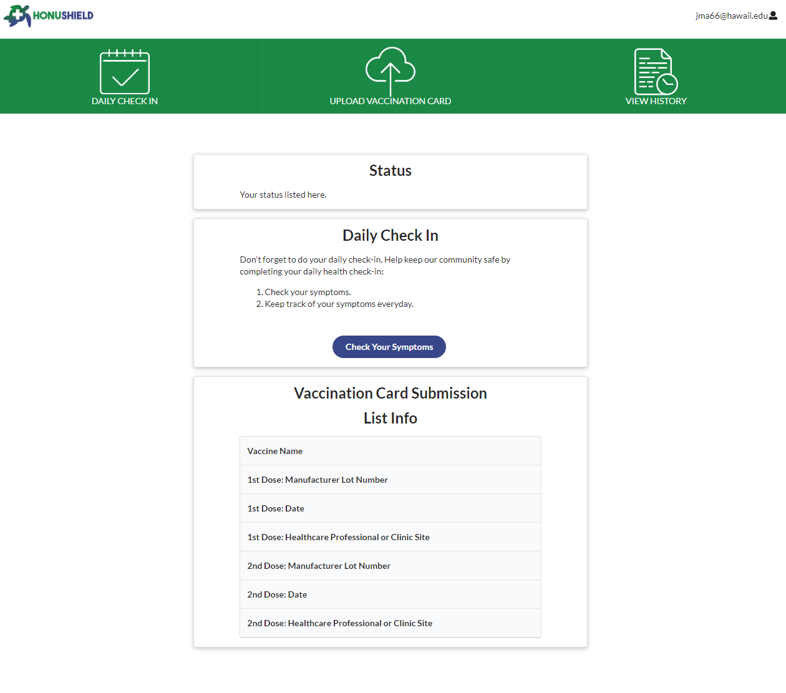
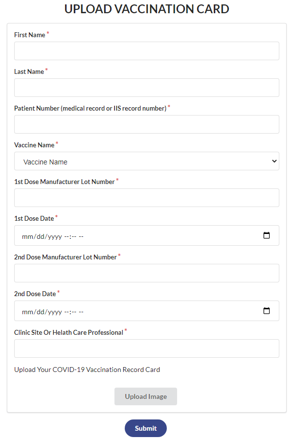

                           

## Team members
- Arslan Rakhmankulov
- Rexter Delos Santos
- Darlene Agbayani
- Christian Siador

## Links
- [Deployed app](https://honushield.meteorapp.com/#/)
- [Github](https://github.com/darleneagbayani/ICS491)

## Overview
Honushield is an application similar to the UH Lumisight app implemented with Meteor and JavaScript. 

It allows students to register with their email and then they can upload their vaccination record.

There is also a daily check-in to see if they have any COVID symptoms.

## Self-assessment
Best way to sum up this project is that I got carried hard by my teammates. It was really challenging to me because I did not have the tech stacks required at the time. I am learning Meteor and JavaScript in another class taken concurrently and I have to essentially self-teach Meteor and JavaScript in advance in order to keep up. Fortunately, my teammates are really helpful and the project was over a period of two months. I was able to implement the landing page over a few days of no sleep and intense hair loss. One thing that I got stuck on the longest was learning how to use the stylesheet. I literally worked on the signup button for two days just to get the styling correct and navigate to other pages. But looking back at the code now it seems like an absolute breeze. Right now I am still lacking knowledge on the server side, but it is a relief that ICS will be going over MongoDB next week and to be honest, I am actually looking forward to it.

  
