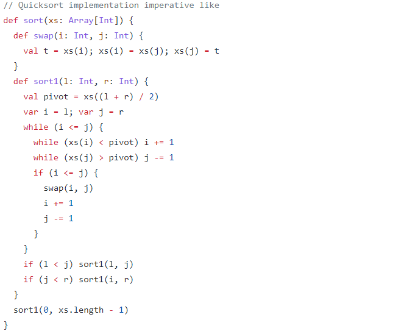
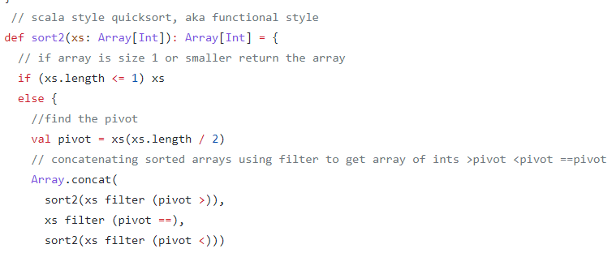

This is a little project I have been working on for the pass month or so. Scala was created by Martin Odersky back in 2001 to show that a fusion of object oriented programming and functional programming was possible and practical. 

Scala is a very interesting language, it's parent language is Java and programs can be written in a total imperative style. If you know Java then Scala is very easy to grasp and you can code in a "Java style". For example the code below shows quicksort written "imperative style" with Scala. 

Now look at the "functional style" Scala was made for

<a href="https://github.com/Jonathan-Ma/Scala-By-Example.git"><i class="large github icon"></i>Scala By Example</a>
