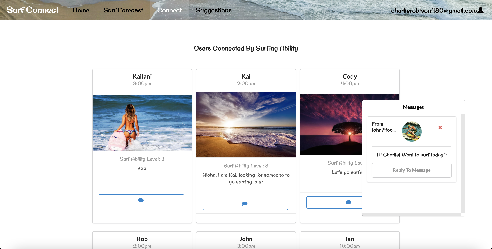
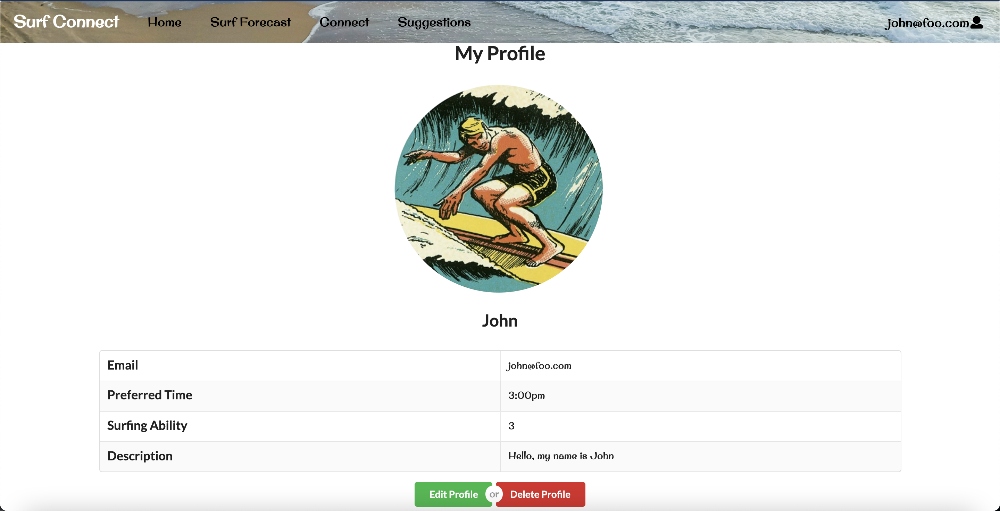

                           

## Team members
- [Charlie Robison](https://charlie-robison.github.io/)
- [Ian Manzano](https://ianbm.github.io/) 

## Links
- [Deployed app](https://surf-connect.xyz)
- [Github](https://github.com/surf-connect)

## Overview
Surf Connect is an application that serves to help students from UH to find other student who want to go surfing at a certain period of the day.

Users can set a time and write a short bio to indicate where and what time they want to go surfing as well as what type of buddies they are looking for.

## Contributions

