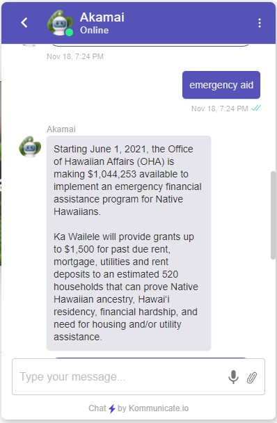

## Team members
- Arslan Rakhmankulov
- Rexter Delos Santos
- Darlene Agbayani
- Christian Siador

## Links
- [Deployed app](https://ohachatbot.meteorapp.com/#/)
- [Github](https://github.com/HACC2021/TeamName404)

## Overview
Office of Hawaiian Affairs works to improve the well-being of Native Hawaiians through advocacy, research, community engagement, land management, and the funding of community programs. OHA also offers a wide range of services, such as grants, scholarships, loans, Hawaiian Registry, legal consultation, etc. The problem is that OHA receives 13,000 calls annually. 11% of the calls never reach anyone and 30 percent of the calls require transfers. Therefore, with the help of a chatbot, users can have a higher chance of finding what they are looking for without waiting on a long waitlist or ending up calling the wrong department.

## Contributions
For this project I contributed to four things:  
(1) I remade the OHA website by using images from the original website because it was better to show how our chatbot looked if it were to be integrated onto their website rather than a plain white background.  
(2) Dialogflow requires training phrases and responses in order for the chatbot to function, this is called an intent. For example, if a training phrase is "hi" and the response is "welcome", then when the user uses the chatbot and types "hi", he or she will get the response in turn. In other words, Dialogflow compares the users input to intent training phrases and finds the best match. Nonetheless, for every intent it is best to have several training phrases that is similar to each other in order to capture the most accurate response. For the "hi" example, I would have to add more training phrases like "hello", "aloha", "hey", etc. I made a total of 9 intents from OHA's most asked questions and implemented them as intents.  
(3) I wrote our teams Devpost story page which includes what the inspiration, overview, what it does, how it's built, and so on, you can check it out [here](https://devpost.com/software/oha-chatbot-team-name-404). 
(4) The last one was unfortunately not presented during judgement day nor was it finished, but it is something I am proud that I took the time to understand. On Dialogflow, you can easily integrate a what they call "telephony". It is identical to how you would make intents for user inputs, however, the difference is that this is a voicebot. You can choose from a list of Google hosted telephone numbers and when you call it, you can say something and Dialogflow matches it with the intent and a robot will reply with the response. Very cool and super easy to use!

